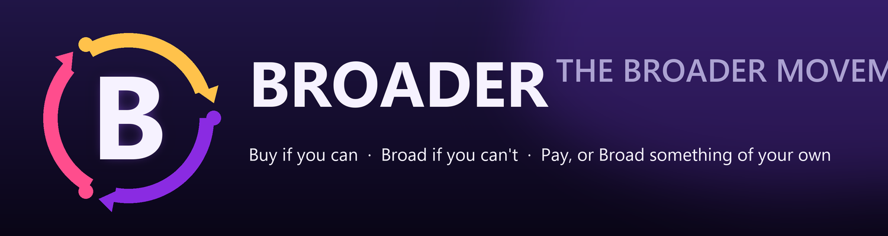

<!--
  ════════════════════════════════════════════════════════════════════
   БРОДЕРСТВО
   «Купи, если можешь · Бродь, если не можешь · Заплати, либо забродь что-то своё»
   Протокол солидарности для доступа к культуре. Не пиратство — обещание.
  ════════════════════════════════════════════════════════════════════
-->

<div align="center">

# 🅱️ БРОДЕРСТВО

**Купи, если можешь · Бродь, если не можешь · Заплати, либо забродь что-то своё**

*Не пиратство. Не кража. Обещание между теми, кто любит культуру, и теми, кто её создаёт.*



🌐 **Языки:** [English](../../README.md) · [Русский](README.md)

</div>

---

## 🧭 Что такое «Бродинг»?

Традиционное пиратство построено на сломанной истории: будто человек без денег — вор. Движение «Бродерство» рассказывает другую историю.

**Бродинг** — это акт обмена медиа через общественный договор солидарности и взаимопомощи. Он происходит, когда сообщество решает, что *доступ к культуре — это право, а не привилегия*, и что каждый, кто может платить, — платит.

### Почему Бродинг заменяет пиратство

| Пиратство | Бродинг |
|---|---|
| Обрамлено как кража | Обрамлено как солидарность |
| Нет обязательств перед автором | Моральный долг, отдаваемый вперёд |
| Анонимное выкачивание | Именное сообщество Бродеров |
| Разрушает доверие | Восстанавливает общественный договор |
| Заканчивается на скачивании | Начинается с обещания |

---

## ⚖️ Три закона Бродерства

### 1. 🛒 Купи, если можешь
Если можешь себе это позволить — покупай. Полная цена, официальные каналы, в день релиза, если тебе это нравится. Твоя покупка — двигатель, который поддерживает культуру, и именно она делает возможными два следующих закона.

### 2. 🕊️ Бродь, если не можешь
Если ты действительно не можешь себе это позволить — из-за бедности, географии, санкций или платного барьера, который тебя отрезает, — ты Бродишь. Ты получаешь произведение свободно, без стыда. Но ты не копишь: ты поддерживаешь поток для следующего Бродера, которому это нужно.

### 3. 🌱 Заплати, либо забродь что-то своё
Когда твои обстоятельства улучшатся, ты закрываешь долг. Заплати — купи произведения, которые провели тебя, и пожертвуй авторам — либо забродь что-то своё, отдав сообществу собственное творение. Так замыкается Цикл Бродера — сдержанное обещание.

---

## 📚 Основная терминология

| Термин | Значение |
|---|---|
| **Бродинг** | Акт обмена медиа в духе этой философии (вместо «пиратства») |
| **Бродер** | Член сообщества (вместо «пирата») |
| **Заброднуть / Заброжено** | Глагол: делиться/получать по Циклу Бродера (вместо «торрентить / личить») |
| **Цикл Бродера** | Экономический подъём: Купи → Бродь → Заплати или забродь своё |
| **Бродеры** | Само сообщество, братство доступа |

---

## 🔄 Цикл Бродера

```
        ┌─────────────────────────────────────────┐
        │                                         │
        ▼                                         │
   ┌─────────┐   can't afford   ┌──────────┐      │
   │   BUY   │ ───────────────▶ │  BROAD   │      │
   └─────────┘                  └──────────┘      │
        ▲                            │            │
        │                            ▼            │
        │                     ┌──────────────┐    │
        │                     │   PAY or     │    │
        └─────────────────────│   BROAD      │────┘
                              └──────────────┘
```

Цикл — это не наказание за бедность, а лестница из неё. Каждый, кто Бродит сегодня, — будущий покровитель завтра.

---

## 📦 Бейджи

[](https://github.com/caendeith/the_broader_movement)
[](BROADER_MANIFESTO.md)
[](BROADER_LICENSE.md)
[](https://github.com/caendeith/the_broader_movement/issues)
[](BROADER_LIBRARY.md)
[]()
[](BROADER_SPEC.txt)

---

## 🤝 Как внести вклад

Мы приветствуем Бродеров любого уровня — писателей, переводчиков, юристов, художников и тех, кто пересылает байты.

### Быстрый старт

1. **Сделай форк** репозитория и склонируй его локально.

2. **Прочитай Манифест** — [`BROADER_MANIFESTO.md`](BROADER_MANIFESTO.md). Это душа проекта.

3. **Выбери направление**:
   - 🖊️ *Документация и переводы* — улучшай любой файл или добавляй язык в [`locales/`](../README.md).
   - ⚖️ *Право* — дорабатывай [`BROADER_LICENSE.md`](BROADER_LICENSE.md).
   - 🎨 *Бренд* — логотипы, баннеры, NFO-арт.
   - 📚 *Библиотека* — добавь своё произведение в [`BROADER_LIBRARY.md`](BROADER_LIBRARY.md).
   - 📡 *Инструменты* — скрипты релизов, помощники сидирования, утилиты контрольных сумм.

4. **Открой Pull Request** с понятным заголовком и короткой заметкой о том, как это служит Циклу.

### Правила участия

- Будь добр. Бродинг — это солидарность, а не жестокость.
- Никакого доксинга, вредоносного ПО и спама.
- Английские исходники — канонические; переводы лежат в `locales/`.

---

## 📁 Структура репозитория

| Файл | Назначение |
|---|---|
| [`README.md`](../../README.md) | Входная дверь (английский). |
| [`BROADER_MANIFESTO.md`](BROADER_MANIFESTO.md) | Философское сердце. |
| [`BROADER_SPEC.txt`](BROADER_SPEC.txt) | Шаблон для релизов. |
| [`BROADER_LICENSE.md`](BROADER_LICENSE.md) | Лицензия общественного договора. |
| [`BROADER_LIBRARY.md`](BROADER_LIBRARY.md) | Каталог произведений и авторов. |
| [`locales/`](../README.md) | Переводы (i18n). |

---

## 🎨 Фирменные ресурсы

| Ресурс | Файл |
|---|---|
| Логотип (вектор / растр) | [`assets/logo.svg`](../../assets/logo.svg) · [`assets/logo.png`](../../assets/logo.png) |
| Иконка приложения | [`assets/icon.svg`](../../assets/icon.svg) · [`assets/icon-512.png`](../../assets/icon-512.png) |
| Баннер | [`assets/banner.svg`](../../assets/banner.svg) · [`assets/banner.png`](../../assets/banner.png) |
| Превью для соцсетей | [`assets/og-image.png`](../../assets/og-image.png) |
| Фавиконка | [`assets/favicon.svg`](../../assets/favicon.svg) · [`assets/favicon-64.png`](../../assets/favicon-64.png) |

---

## 🌐 Локализация

Исходный язык проекта — **английский**. Переводы лежат в [`locales/`](../README.md), по папке на код языка.

Доступные языки:

- 🇬🇧 [English](../../README.md)
- 🇷🇺 [Русский](README.md)

Как добавить язык — см. [`locales/README.md`](../README.md).

---

## ⚖️ Лицензия

Это движение и его документы выпущены под **[Лицензией Бродера](BROADER_LICENSE.md)** — общественным договором в духе copyleft. Делись свободно, указывай авторство всегда, отдавай вперёд — или забродь своё — когда можешь.

---

<div align="center">

**Сделано с ❤️ и обещанием — Бродерами, для Бродеров.**

*Купи, если можешь · Бродь, если не можешь · Заплати, либо забродь что-то своё.*

</div>
